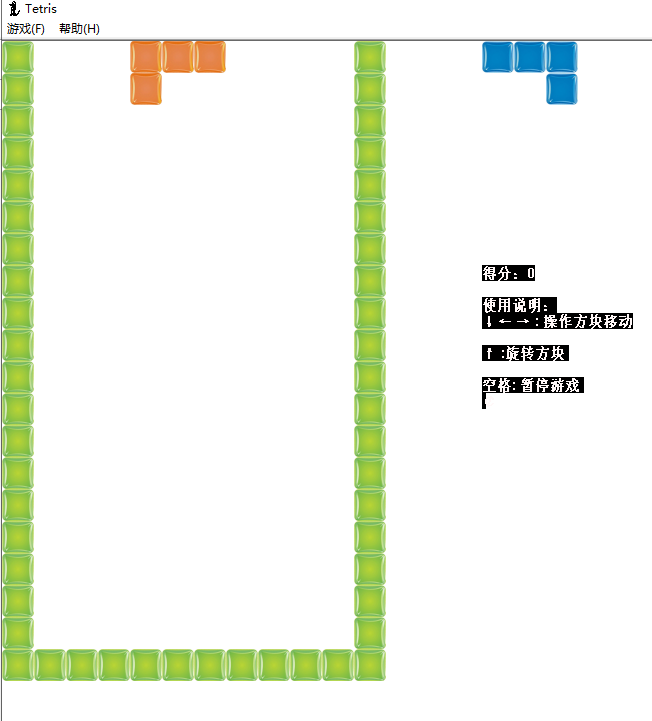

## 简介：

以前学汇编时，用汇编写了一些工具，翻出来个小游戏，传上来做个纪念。
本工具为俄罗斯方块游戏，带界面。 编写时间用了周末2天。

## 环境：

系统：windows系统，
cpu:  x86指令集架构，
编译工具：MASM32

## 编译:

1. 配置好MASM32的环境变量;
2. 将ml和link改名，这里改成了ml_asm.exe和link_asm.exe；(非必须，主要防止与其它编译工具中的ml和link同名，导致调用错误)
3. 运行build.bat脚本。（注意：脚本中ml和link命令，要与masm中的同名。）

## 运行界面：

